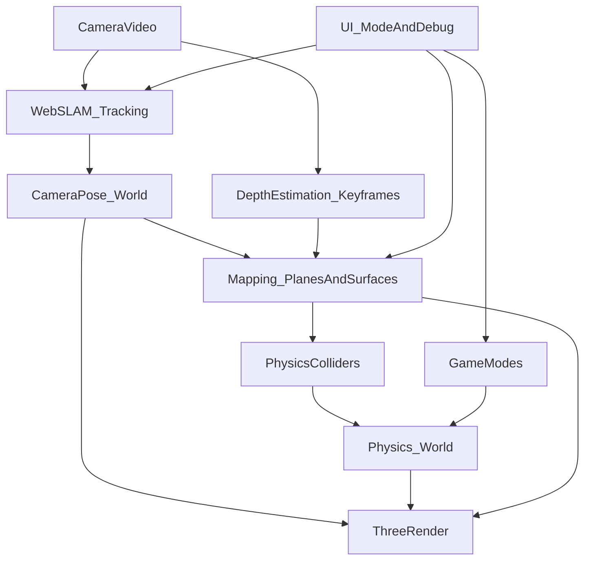

## Текущее состояние (что уже есть)

- [`c:\Users\777\Desktop\game-demo\src\main.ts`](c:\Users\777\Desktop\game-demo\src\main.ts): монолитный файл, UI + цикл рендера + “якорная плоскость” и режим бега по `depthMesh`.
- [`c:\Users\777\Desktop\game-demo\src\depth\depth.ts`](c:\Users\777\Desktop\game-demo\src\depth\depth.ts): depth estimation через `@xenova/transformers` (Depth Anything) **в режиме single-shot/фото**.
- [`c:\Users\777\Desktop\game-demo\src\depth\depth-mesh.ts`](c:\Users\777\Desktop\game-demo\src\depth\depth-mesh.ts): построение `depthMesh` (плоскость + displacement) и текстурирование RGB.
- [`c:\Users\777\Desktop\game-demo\src\game\anchors.ts`](c:\Users\777\Desktop\game-demo\src\game\anchors.ts): “якорь” — это просто плоскость на фиксированной глубине вдоль луча, без real tracking.
- `cannon-es` подключён в `package.json`, но **в коде не используется**.

## Цели и ограничения

- Цель: **реальный трекинг позы телефона в браузере** + **живой мир** (можно ходить вокруг; поверхности/якоря остаются стабильными).
- Ограничение: **без ARCore/ARKit/WebXR‑AR**.
- Следствие: нужно добавить **Web‑SLAM** и продумать **масштаб (метры)**, т.к. монокулярный SLAM/глубина дают относительную геометрию.

## Архитектура (куда переработать)

- Разделить текущий `main.ts` на слои:
  - `src/mr/tracking/*`: видео → SLAM → поза камеры (и, по возможности, intrinsics/projection).
  - `src/mr/mapping/*`: depth/pointcloud → детекция плоскостей/поверхностей → мир (поверхности, якоря, коллайдеры).
  - `src/physics/*`: `cannon-es` world/step + синхронизация Three meshes.
  - `src/game/*`: 3 режима игры как state machine поверх общих `tracking/mapping/physics`.
  - `src/ui/*`: режимы, отладка, UX сканирования/калибровки.

## Дорожная карта по этапам

### Этап A — Ввести трекинг позы (Web‑SLAM) и “правильную” MR‑камеру

- Интегрировать SLAM библиотеку (из вашего `research.md` ориентир — **AlvaAR**):
  - поток: `HTMLVideoElement` → кадры → SLAM update → `cameraPose`.
  - связать `cameraPose` с `THREE.PerspectiveCamera` (позиция/кватернион) и согласовать FOV/проекцию.
- Добавить UX трекинга:
  - статусы: initializing / tracking / lost.
  - reset world.
- Результат: 3D‑объекты “прибиты” к миру при движении камеры.

### Этап B — Масштаб и гравитация (чтобы физика была в метрах)

- Проблема: монокулярный SLAM даёт **произвольный масштаб**, depth‑модель — **относительную глубину**.
- Реалистичный MVP‑подход к масштабу (без IMU‑позиции):
  - **калибровка пользователем**: задать “этот отрезок = 1 метр” (2 тапа по одной поверхности) или “высота камеры над полом = X см”.
  - затем фиксировать scale‑factor мира.
- (Опционально позже) авто‑подстройка scale через сопоставление depth‑карты с SLAM‑точками.

### Этап C — Поверхности реального мира: плоскости и/или грубая сетка

- MVP для механики 1 (runner):
  - брать depth на ключевых кадрах (не каждый кадр), back‑project в 3D в координатах камеры, переносить в мир через `cameraPose`.
  - искать **доминирующую плоскость** (RANSAC) для пола/стола; поддерживать несколько плоскостей (кластеризация по normal+offset).
  - делать “патчи” плоскостей (границы/extent) и обновлять их постепенно (temporal smoothing).
- Представление мира:
  - `WorldSurface`: id, type (floor/table/wall/unknown), plane equation, polygon/extent, confidence, lastSeen.
  - экспорт в Three (debug mesh) и в physics (colliders).

### Этап D — Встроить `cannon-es` как единый физический слой

- Создать `PhysicsWorld`:
  - fixed timestep, broadphase, материалы/трение.
  - адаптер “ThreeMesh <-> CannonBody”.
- Коллайдеры мира:
  - плоскости: `Plane` или thin `Box` (если нужны границы).
  - позже: упрощённые mesh/heightfield коллайдеры (дороже).

### Этап E — Механика 1: кубик‑runner по реальным поверхностям

- Перевести куб из “визуальной болванки” в физический body:
  - управление: силы/скорость по касательной к поверхности.
  - прыжок: импульс вдоль нормали поверхности.
- Контакт с поверхностью:
  - выбирать “активную” поверхность под кубом (по ближайшей плоскости/extent + raycast вниз).
- Минимальный геймплей: бег + препятствия (виртуальные блоки) размещаемые на найденной поверхности.

### Этап F — Механика 2: «Angry Birds на примитивах» на реальных поверхностях

- Режим построения сцены:
  - выбираем поверхность (floor/table) → ставим “постройки” из примитивов (box/cylinder) с физикой.
- Режим запуска:
  - рогатка/катапульта: направление берём из камеры/тач‑drag, сила по длине drag.
  - projectile (sphere/box) летит и ломает постройки.
- Важно: синхронизация units/scale и трение/упругость для “сыпется приятно”.

### Этап G — Механика 3: поиск предметов в комнате по позе телефона

- Базовая модель:
  - предметы имеют world‑позиции (привязаны к поверхностям/якорям).
  - “поиск” = близость + проверка, что предмет попадает в FOV/центр экрана + нет “стены” между камерой и предметом (raycast по поверхностям).
- MVP‑UX:
  - «сканируй комнату → появятся N предметов»
  - радар/стрелка направления (в world coords), подсказки по расстоянию.
- (Позже) персистентность: сохранение seed/якорей в localStorage на сессию; полноценное “узнавание комнаты” — отдельная большая задача.

## Конкретная переработка кода (первые файлы, которые тронем)

- Разрезать [`c:\Users\777\Desktop\game-demo\src\main.ts`](c:\Users\777\Desktop\game-demo\src\main.ts) на модули:
  - `src/app/app.ts` (bootstrap + state machine)
  - `src/ui/*` (HUD, joystick, debug)
  - `src/mr/tracking/*` (SLAM integration)
  - `src/mr/mapping/*` (depth keyframes → planes)
  - `src/physics/*` (cannon-es world)
  - `src/game/runner/*`, `src/game/angry/*`, `src/game/treasure/*`
- Сохранить/переиспользовать текущие полезные части:
  - `depth.ts` и `depth-mesh.ts` как источники depth и визуализации.
  - `mask/*` как временный debug‑инструмент (позже заменить на настоящую occlusion‑маску/глубину).

## Риски и как их минимизировать

- SLAM в браузере чувствителен к свету/текстурам → нужен UX «медленно поводите камерой», индикатор качества.
- Масштаб/метры без ARCore/ARKit → нужен этап калибровки (иначе физика будет “в попугаях”).
- Производительность depth‑инференса → только keyframes + downscale + worker, а не каждый кадр.

## Definition of Done для MVP (чтобы было играбельно)

- Камера трекается в мире (можно пройти 2–3 метра, объекты остаются на месте).
- Авто‑детекция хотя бы одной поверхности (пол/стол) и кубик бегает по ней с прыжком.
- Angry‑режим: поставить 5–10 блоков на поверхности и разрушить 3–5 снарядами.
- Поиск: 3 предмета заспавнены в мире, их можно найти, подходя и направляя камеру.